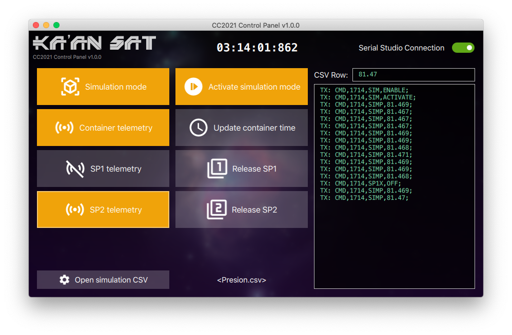

# CanSat Competition 2021 Control Panel

Serial Studio companion application that allows users to send simulated pressure data to the CanSat container & control scientific payload operations.

## Cloning

This repository makes use of [`git submodule`](https://git-scm.com/book/en/v2/Git-Tools-Submodules). In order to clone it, execute this commands on your Terminal:

	git clone https://github.com/Kaan-Sat/CC2021-Control-Panel/
	cd QtApp-Template
	git submodule init
	git submodule update
	
Alternatively, just run:

	git clone --recursive https://github.com/Kaan-Sat/CC2021-Control-Panel/

## License

This project is released under the MIT license. For more information, click [here](LICENSE.md).
